# 🚀 ASP.NET MVC Blog & CMS (Yapay Zeka Destekli)

Bu proje, **ASP.NET MVC 5** mimarisi üzerine inşa edilmiş, **Google Gemini AI** ile güçlendirilmiş modern bir blog platformudur. Çok katmanlı (N-Tier) mimari, dinamik içerik yönetimi ve yapay zeka destekli moderasyon sistemi ile güvenli ve etkileşimli bir deneyim sunar.

## 📸 Proje Galerisi

<div align="center">
  <h3>🏠 Ana Sayfa ve Arayüz</h3>
  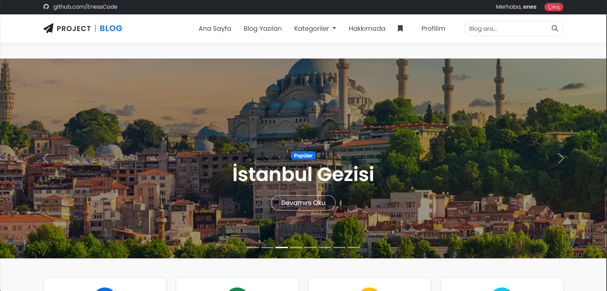
  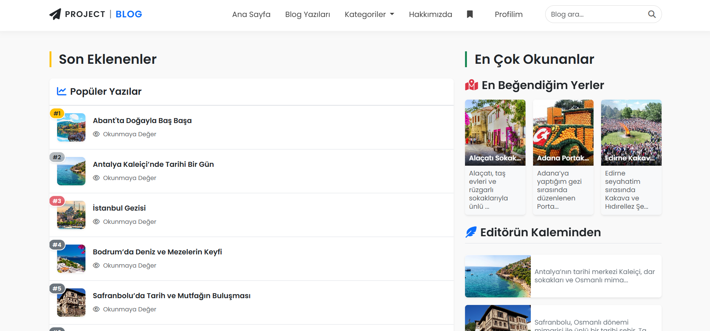
  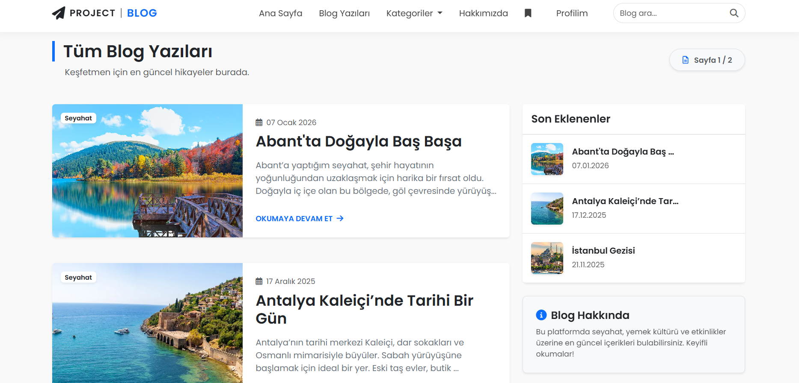
  
  <br/><br/>

  <h3>📖 Blog Detay ve Yapay Zeka Etkileşimi</h3>
  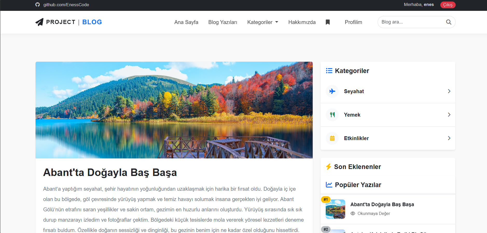
  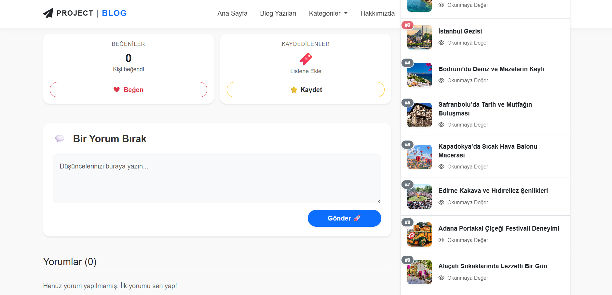
  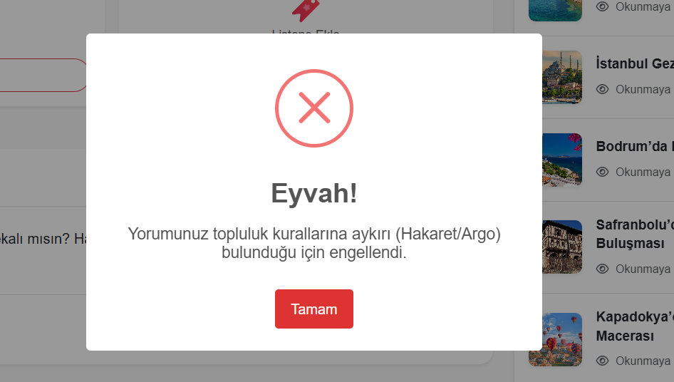

  <br/><br/>

  <h3>🛡️ Yönetim ve Yazar Panelleri</h3>
  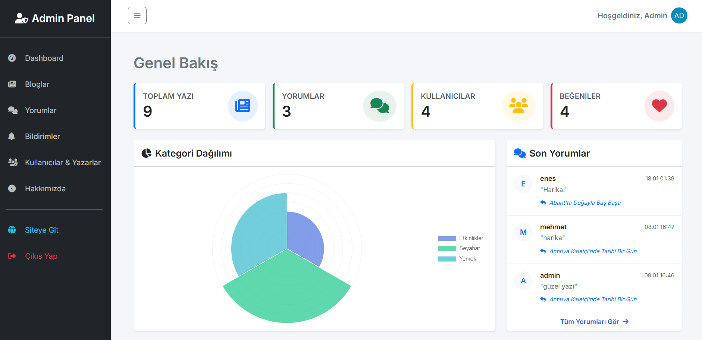
  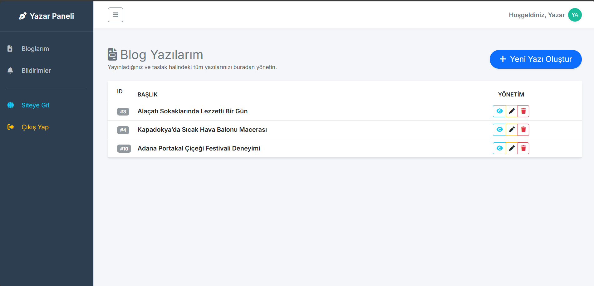
  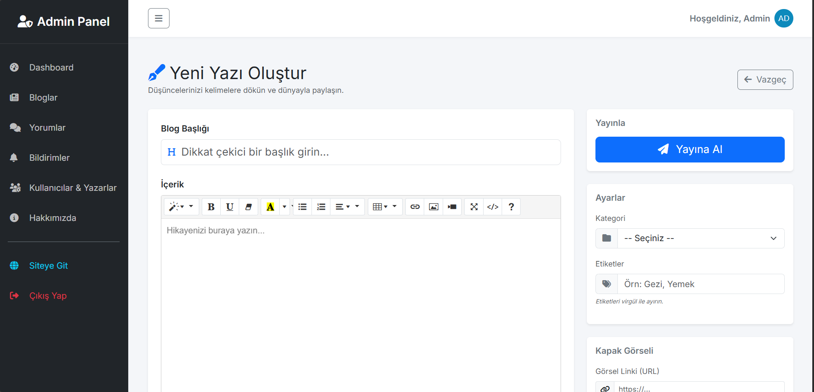

  <br/><br/>

  <h3>👤 Kullanıcı İşlemleri</h3>
  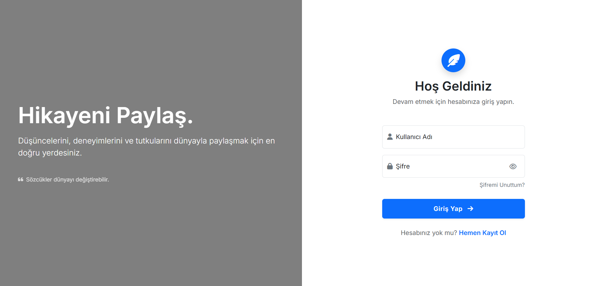
  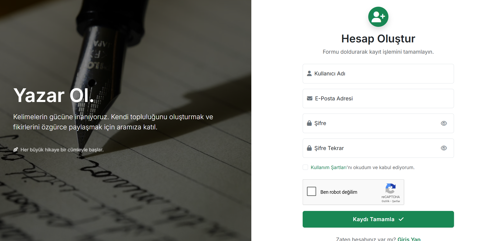
  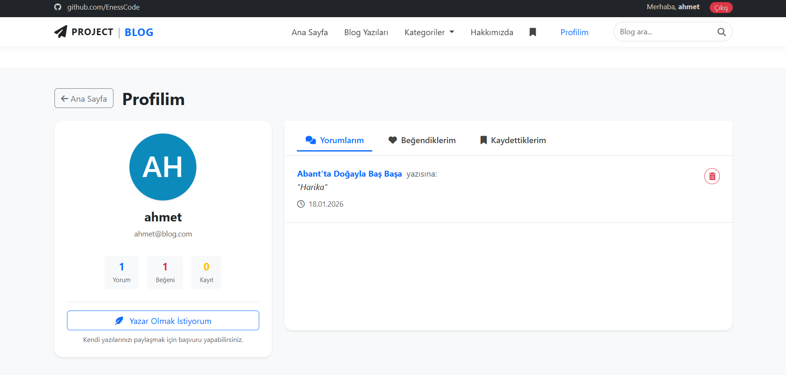
</div>

## ✨ Öne Çıkan Özellikler

### 🤖 Yapay Zeka Destekli Moderasyon
- **Google Gemini Entegrasyonu:** Kullanıcıların yaptığı yorumlar veritabanına kaydedilmeden önce **Google Gemini 2.5 Flash** modeli tarafından analiz edilir.
- **Akıllı Filtreleme:** Küfür, hakaret, nefret söylemi veya tehdit içeren yorumlar yapay zeka tarafından anında tespit edilir ve engellenir.
- **Anlık Geri Bildirim:** **AJAX** altyapısı sayesinde sayfa yenilenmeden yorum gönderilir; AI reddederse `SweetAlert2` ile kullanıcıya anında uyarı verilir.

### 🛡️ Yönetici (Admin) Paneli
- **Görsel Dashboard:** `Chart.js` entegrasyonu ile kategori dağılımı ve sayısal veriler.
- **İstatistikler:** Toplam yazı, yorum, kullanıcı ve beğeni sayılarının anlık takibi.
- **İçerik Yönetimi:** Tüm blog yazıları, kategoriler ve kullanıcılar üzerinde tam yetki.

### ✍️ Yazar (Author) Paneli
- **İçerik Üretimi:** Zengin metin editörü ile blog yazısı oluşturma/düzenleme.
- **Yazar İstatistikleri:** Yazarların kendi yazılarını ve etkileşimlerini takip edebilmesi.

### 👤 Kullanıcı (User) Deneyimi
- **Etkileşim:** Yazılara yorum yapma, **Beğenme (Like)** ve **Kaydetme (Bookmark)** özellikleri.
- **Profil Yönetimi:** Sekmeli yapı ile "Yorumlarım", "Beğendiklerim" ve "Kaydettiklerim" listelerine erişim.
- **Güvenlik:** Kullanıcı şifreleri ve hassas veriler güvenli bir şekilde saklanır.
- **Modern Arayüz:** Dinamik slider, kategori widget'ları ve responsive tasarım.

## 🛠️ Teknolojiler

* **Backend:** C#, ASP.NET MVC 5, LINQ
* **AI & API:** Google Gemini API (Model: `gemini-2.5-flash`), RESTful Services
* **Database:** MSSQL, Entity Framework 6 (Code First)
* **Frontend:** HTML5, CSS3, Bootstrap 5, AJAX, jQuery
* **Libraries:**
    * **SweetAlert2:** Modern uyarı pencereleri.
    * **Chart.js:** Veri görselleştirme.
    * **Newtonsoft.Json:** JSON veri işleme.
    * **FontAwesome:** İkon setleri.

## ⚙️ Kurulum

Proje güvenliği için API anahtarları ve veritabanı bağlantıları dış dosyalarda tutulmaktadır. Kurulum için aşağıdaki adımları izleyin:

1.  Repoyu klonlayın:
    ```bash
    git clone [https://github.com/EnessCode/AspNet-MVC-Gemini-Blog.git](https://github.com/EnessCode/AspNet-MVC-Gemini-Blog.git)
    ```

2.  Projenin ana dizininde `ConnectionStrings.config` adında bir dosya oluşturun ve içine SQL bağlantınızı ekleyin:
    ```xml
    <connectionStrings>
      <add name="Context" connectionString="data source=YOUR_SERVER_NAME;initial catalog=BlogDb;integrated security=True;" providerName="System.Data.SqlClient" />
    </connectionStrings>
    ```

3.  Yine ana dizinde `AppSettingsSecrets.config` adında bir dosya oluşturun ve API anahtarlarınızı ekleyin:
    ```xml
    <appSettings>
        <add key="ReCaptchaSecret" value="SENIN_RECAPTCHA_KEYIN" />
        <add key="GeminiApiKey" value="SENIN_GOOGLE_GEMINI_API_KEYIN" />
    </appSettings>
    ```

4.  Package Manager Console'u açıp veritabanını oluşturun:
    ```bash
    Update-Database
    ```

5.  Projeyi `Ctrl + F5` ile çalıştırın.

---
*Geliştirici: EnessCode*